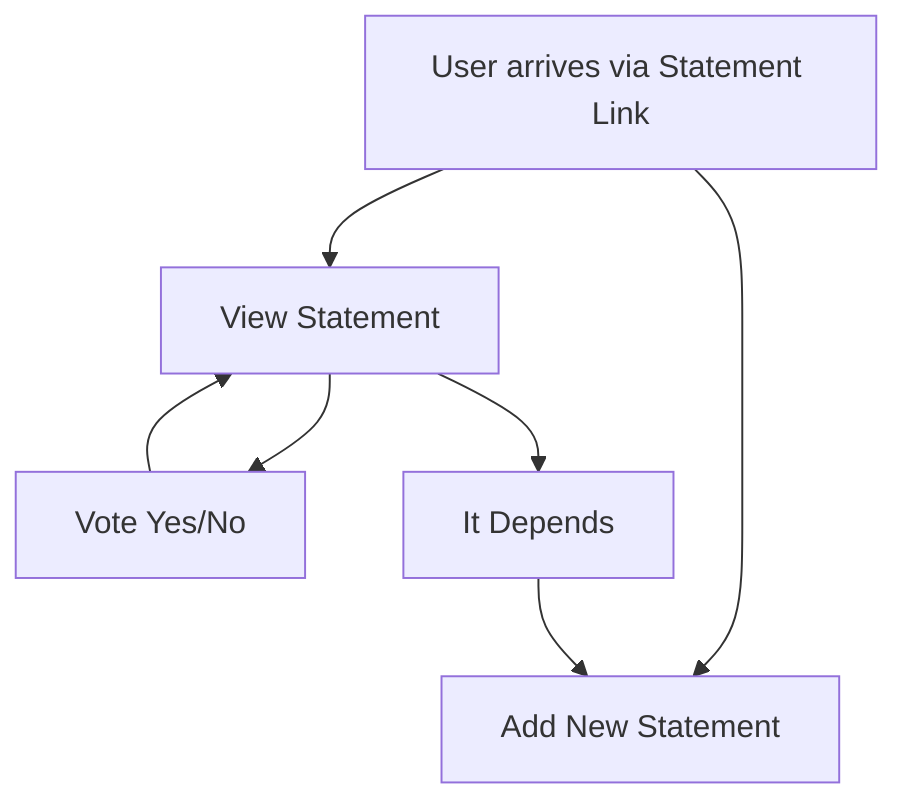

#  Propolis
Enable useful discussions among thousands of people.

Try it: <https://propolis.fly.dev>

## User Flow



## Development

```bash
just reset-db
just develop
```
Open in browser: <https://localhost:8000>

## Benchmarking

Start release web server:

```bash
cargo run --release
```

Then benchmark:

```bash
just benchmark
```
